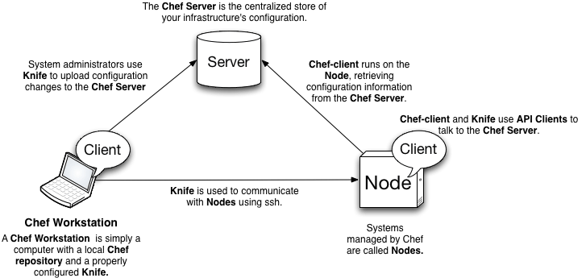
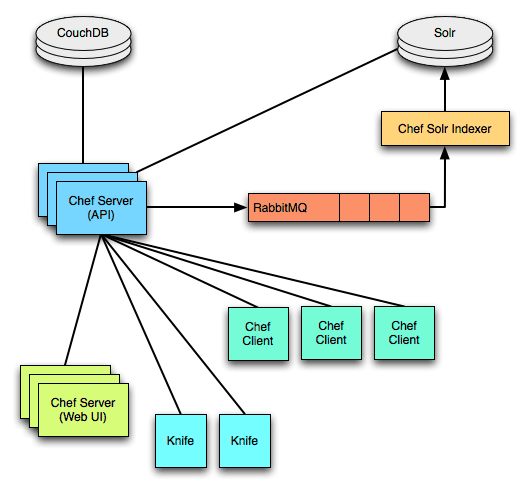
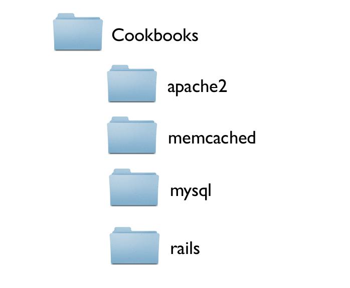
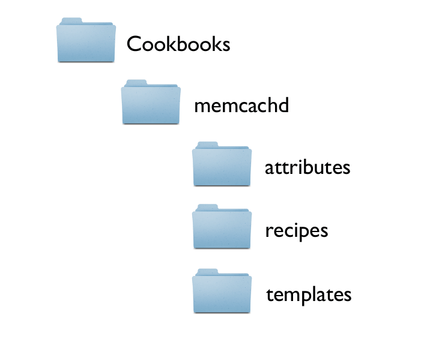
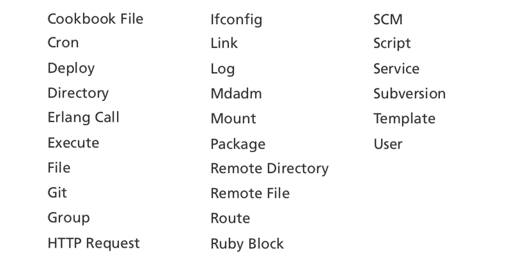
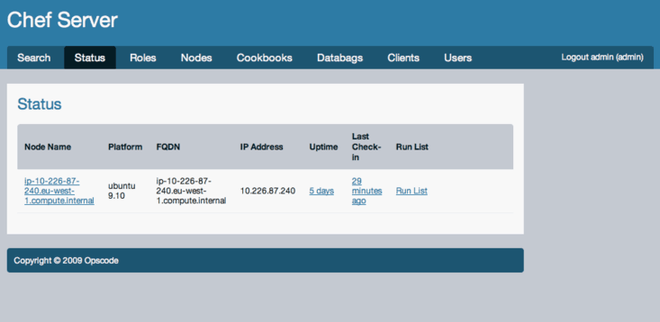

# Chef Nedir?

.fx: first

Emre Can Yılmaz `<ecylmz@bil.omu.edu.tr>`

[http://ecylmz.com/](http://ecylmz.com)

Temmuz 2012

---

# Chef Nedir?

---

# Chef

- Sistem yönetimini kolaylaştırmayı hedefleyen, altyapılarınızı otomatize etme imkanı sağlayan,  merkezi bir sistem tarafından yönetilme amacıyla yazılmış açık kaynaklı bir yazılımdır.

---

# Chef ile Yapılabilecekler

- Sistemleri kod yazarak yönetme imkanı sağlar.
- "Search" özelliği ile sunucular içinde özelliğine göre arama yapar.
  Ör: Hangi uygulamanın hangi sunucu üzerinde olduğu hakkında
  bilgi verir.
- Kütüphaneleri sayesinde mevcut uygulamalarla entegre şekilde çalışır. Nginx, MySQL ...

---

# Neden Chef?

- Tekrar edilen işlemleri azaltır.
- İşler otomatize edildiği için, harcanan süre azalır.

  Ör: nginx kurulumu, rails sunucu kurulumu vb...

- İstenilen sunucuların **hepsinde**, aynı işlemi tek bir kod'la yapmak mümkündür.

  Ör: Sistem saatinin 1 saniye ileri alınması, sunucu güncelleştirmeleri, önemli bir paket kurulumu vs ...

---

# Neden Chef?

### Geliştirici:

- "Benim makinemde bu çalışıyordu."
- "Ruby on Rails'in x.y.z versiyonu lazım."
- "Yeri gelmişken; projenin yarına kadar deploy edilmesi gerekiyor."

### Sistem Yöneticisi

- "Bu versiyonu desteklemiyoruz."
- "Projenin mimari yapısı bizim yapımızla uyuşmuyor."

---

# Chef'in Puppet'dan farklılıkları

- Yapılandırma Ruby ile yazılıyor. Nadiren DSL kullanılır.
- Çok basit bir DSL yapısı vardır.
- Mevcut alt yapıyla uyumlu bir şekilde çalışır.
- Chef ile hazırlanan "tarifler" kanonik değildir. Değişkenler sayesinde bir çok
  chef istemcide çalışabilir.

---

# Mimari Yapı

---

# Mimari Yapı

---

# Chef Solo

---

# Chef

---

# Chef Dizin Yapısı

---

# Cookbooks

---

# Memcached Cookbook

---

# Memcached Cookbook

---

# Attributes

**cookbooks/memcached/attributes/default.rb**

    !ruby
    default[:memcached][:user]    = 'nobody'
    default[:memcached][:port]    = '11211'
    default[:memcached][:memory]  = '512'

Değişkenlerin öntanımlı değerlerini `recipes` ve şablonlarda kulanıyoruz.

---

# Recipes

**cookbooks/memcached/recipes/service.rb**

    !ruby
    service "memcached" do
      start_command   "/etc/init.d/memcached start"
      stop_command    "/etc/init.d/memcached stop"
      restart_command "/etc/init.d/memcached restart"
      action :nothing
    end

---

# Recipes

**cookbooks/memcached/recipes/install.rb**

    !ruby
    include_recipe "memcached::service"

    package "memcached"
    package "libmemcached-dev"

    template "/etc/memcached/memcached.conf"
      source "memcached.conf.erb"
      owner "root"
      group "root"
      mode 0644

      notifies :restart, resources(:service => "memcached)
    end

---

# Şablonlar

**cookbooks/memcached/templates/default/memcached.conf.erb**

    !ruby
    #
    # Configured by Chef. Local changes will be lost.
    #

    # Run memcached as a daemon
    -d

    # Log memcached's output to /var/log/memcached
    logfile /var/log/memcached.lg

    # max memory to use by memcached
    -m <%= node[:memcached][:memory] %>

    # Default connection port is 11211
    -p <%= node[:memcached][:port] %>

    # user to run daemon as
    -u <%= node[:memcached][:user] %>

---

# Chef-Solo'nun çalışması

JSON'ı yapılandır: **/etc/chef/solo.json**

    {
      "memcached": {
        "memory": "1024"
      },
      "run_list": [
        "recipe[memcached::install]",
        "recipe[apache2::restart]"
      ]
    }

Chef-Solo'yu çalıştır:

    !sh
    $ chef-solo -c /etc/chef/solo.rb -j /etc/chef/solo.sjon

---

# Kullanılabilir Kaynaklar

---

# User & Group Kaynağı

    !ruby
    user "random" do
      comment "Random User"
      uid "1000"
      gid "users"
      home "/home/random"
      shell "/bin/zsh"
      password "$1$JJsvHslV$qwejıoqwJsadHNiqwe."
    end

    group "admin" do
      gid 999
      members ['vaco', 'vicente']
    end

---

# Cron Kaynağı

    !ruby
    cron "noop" do
      hour "5"
      minute "0"
      command "/bin/true"
    end

    cron "ganglia_tomcat_thread_max" do
      command "/usr/bin/gmetric -n 'tomcat-max' -v `tomcat-stat --thread-max`"
      only_if do
        File.exist?("/home/jboss")
      end
    end

---

# Execute Kaynağı

    !ruby
    execute "build WAR file" do
      cwd "/home/tomcat/myapp"
      command "mvn build && cp build/myapp.war /var/lib/tomcat/webapps"
      user "tomcat"
    end

    execute "restart custom tomcat" do
      command "tomcat_wrapper.sh restart"
      environment "PATH" => "/opt/local/bin", "HOME" => "/home/tomcat"
    end

---

# Package Kaynağı

    !ruby
    package "tar" do
      version "1.16.1-1"
      action :install
    end

    package "debian-archive-keyring" do
      action :install
      options "--force-yes"
    end

    package "apache2" do
      action :remove
    end

---

# Script Kaynağı

    !ruby
    script "install_something" do
      interpreter "bash"
      user "root"
      cwd "/tmp"
      code <<-EOH
      wget http://example.com/tarball.tar.gz"
      tar -zxf tarball.tar.gz
      cd tarball
      ./configure
      make
      make install
      EOH
    end

**bash, csh, Ruby, Python ve Perl desteği sağlamaktadır**

---

# Kaynakların İçerisinde Kullanılan Metotlar

Genel metotlar:

- action
- provider
- Supports
- ignore_failure
- not_if / only_if
- notifies
- subscribes

---

# Bildirimler

**Bir kaynaktan `execute` kaynağına bildirim gönderme

    !ruby
    template "/etc/memcached/memcached.conf" do
      source "memcached.conf.erb"
      owner "root"
      group "root"
      mode 0644

      notifies :restart, resources(:service => "memcached")
    end

---

# Roller

- `Recipe` ve `attributes`'ların birleşiminden oluşur.
- Düğümler birden fazla rol içerebilir.

    !ruby
    run_list "recipe[apache2]", "recipe[apache2::mod_ssl]", "role[monitor]"

---

# Rol Tanımlama

    !sh
    $ cat roles/webserver.rb

    !ruby
    name "webserver"

    description "The base role for systems that serve HTTP traffic"

    run_list "recipe[apache2]", "recipe[apache2::mod_ssl]", "role[monitor]"

    default_attributes "apache2"  => { "listen_ports" => [ "80", "443" ] }
    override_attributes "apache2" => { "max_children" => "50" }

---

# Diğer İmkanlar

---

# Web Kullanıcı Arayüzü

** Sinatra web uygulamasıyla düğümleri, cookbook'ları ve rolleri yönet**

---

# Knife

Chef-server için istemci aracıdır:

- Düğümleri, cookbook'ları ve attributes'ları listeşer
- Rol ataması yapar.
- Yeni cookbook yükler.

---

# Knife

Örnek olabilecek bir kaç knife komutu:

    !sh
    $ # ubuntu yüklü sunucuları listele
    $ knife search node 'platfo*:ubuntu'
    $ # Düğümlerin hepsini listele
    $ knife search node "*:*"

---

# Solr

Düğümlerin niteliklerine göre arama yapar:

**recipes & templates içerisindeyken**

    !ruby
    template "/srv/www/myapp/conf/database.inc.php"
      source "database.inc.php.erb"
      variables :db_servers => search(:node, 'run_list:"recipe[mysql::server]"')
    end

**knife ile**

    !sh
    $ knife search node 'network_interfaces_X_addresses:192.168*

---

# Kaynak

[http://wiki.opscode.com/display/chef](http://wiki.opscode.com/display/chef)
