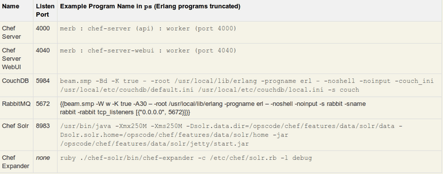

# Chef-Server ve Chef-Client

.fx: first

Emre Can Yılmaz `<ecylmz@bil.omu.edu.tr>`

[http://ecylmz.com/](http://ecylmz.com)

Nisan 2012

---

# Server Kurulumu ve Yapılandırılması

---

# Server Kurulumu

Ubuntu'da Chef 0.10.x için:

    !sh
    $ echo "deb http://apt.opscode.com/ `lsb_release -cs`-0.10 main" | \
        sudo tee /etc/apt/sources.list.d/opscode.list

GPG Anahtarı Ekleyelim:

    !sh
    $ sudo mkdir -p /etc/apt/trusted.gpg.d
    $ gpg --keyserver keys.gnupg.net --recv-keys 83EF826A
    $ gpg --export packages@opscode.com | sudo tee \
        /etc/apt/trusted.gpg.d/opscode-keyring.gpg > /dev/null

---

# Server Kurulumu

**Bir önceki adımda sorun çıkması halinde**

    !sh
    $ gpg --fetch-key http://apt.opscode.com/packages@opscode.com.gpg.key

    $ gpg --export packages@opscode.com | sudo tee \
        /etc/apt/trusted.gpg.d/opscode-keyring.gpg > /dev/null

---

# Server Kurulumu

Opscode Deposu etkinleştirilir ve varolan paketler yükseltilir:

    !sh
    $ sudo apt-get update

    $ sudo apt-get install opscode-keyring

    $ sudo apt-get upgrade

Chef paketi yüklenir:

    !sh
    $ sudo apt-get install chef chef-server

Bu sırada chef-server url istenir:

`http://foo.example.com:4000`

Ayrıca `rabbitmq` tüketici ve `webui` yönetici parolası da istenir.

---

# Bileşenlerin Çalıştığını Doğrulayalım

Chef-Server yüklendiğinde aşağıdaki proseslerin çalıştığını görmemiz gerekir:

---

# Komut Satırı için Yapılandırma

Chef'in bileşenlerinin çalıştığından emin olduktan sonra **knife** komut satırı
aracını yapılandıralım.

Önce ~/.chef dizini oluşturulup sunucu tarafından oluşturulan sertifikaları
kopyalayalım:

    !sh
    $ mkdir -p ~/.chef
    $ sudo cp /etc/chef/validation.pem /etc/chef/webui.pem ~/.chef
    $ sudo chown -R $USER ~/.chef

---

knife istemci yapılandırmasına geçebiliriz...

    chef-server > knife configure -i
    Where should I put the config file? [~/.chef/knife.rb]
    Please enter the chef server URL: [http://localhost:4000]
    Please enter a clientname for the new client: [ecylmz]
    Please enter the existing admin clientname: [chef-webui]
    Please enter the location of the existing admin client's private key:
    [/etc/chef/webui.pem] .chef/webui.pem

`chef-validator` yeni node'ları otomatik kaydeder.

    Please enter the existing admin clientname: [chef-webui]
    Please enter the location of the existing admin client's private key:
    [/etc/chef/webui.pem] .chef/webui.pem

Son olarak Chef Deposu adresi isteniyor. Cookbook'lar burada duracak.

    Please enter the path to a chef repository (or leave blank):
    WARN: Creating initial API user...
    INFO: Created (or updated) client[ecylmz]
    WARN: Configuration file written to /home/ecylmz/.chef/knife.rb

---

# Knife İstemci Yapılandırmasını Doğrula

Aşağıdaki basit komutla sunucuda istemcileri doğrulayabiliriz:

    chef-server> knife client list
      chef-webui
      ecylmz
      chef-validator

    chef-server> knife cookbook list

---

# Kendi Bilgisayarına Knife İstemci Oluştur

    chef-server> knife client create my-username -d -a -f /tmp/my-username.pem
    INFO: Created (or updated) client[my-username]

Bu komut **/tmp/my-username.pem** dosyasını oluşturdu. İşlemi onaylamak için `
knife client show` komutu verilir.

    chef-server> knife client show my-username
    admin:      true
    chef_type:  client
    json_class: Chef::ApiClient
    name:       "my-username"
    public_key: "-----BEGIN RSA PUBLIC
    KEY-----\nMIIBCgKCAQEAvZQlkA3EzaC+qtsZnSZG6ildyCVXvnQqShOm4\ (...)
    \n-----END RSA PUBLIC KEY-----\n"

---

# Anahtarı Kopyala ve Knife'ı Yapılandır

scp ile chef-server'dan my-username.pem dosyası alınır:

    your-laptop > mkdir ~/.chef
    your-laptop > scp chef-server.example.com:/tmp/my-username.pem \
        ~/.chef/my-username.pem

### Knife'ı bilgisayarına kur:

    !sh
    $ sudo gem install chef

Knife yapılandırma:

    your-laptop > knife configure
    No knife configuration file found

    Where should I put the config file? [~/.chef/knife.rb]
    Please enter the chef server URL: [http://localhost:4000]
    http://chef-server.example.com:4000

    Please enter an existing username or clientname for the API: [my-username]
    my-username

    Please enter the validation clientname: [chef-validator]
    Please enter the location of the validation key: [/etc/chef/validation.pem]

    Please enter the path to a chef repository (or leave blank):
    WARN: *****
    WARN:
    WARN: You must place your client key in:
    WARN:   /Users/you/.chef/my-username.pem
    WARN: Before running commands with Knife!
    WARN:
    WARN: *****
    WARN:
    WARN: You must place your validation key in:
    WARN:   /etc/chef/validation.pem
    WARN: Before generating instance data with Knife!
    WARN:
    WARN: *****
    WARN: Configuration file written to /Users/you/.chef/knife.rb

---

# Yapılandırmayı Doğrula

    your-laptop > knife client list
      chef-webui
      my-username
      bob
      chef-validator

    your-laptop > knife client show chef-validator
      name:       chef-validator
      public_key:
      admin:      false
      json_class: Chef::ApiClient
      chef_type: client

---

# Client Kurulumu ve Yapılandırılması

---

# Client Kurulumu

Ubuntu'da Chef 0.10.x için:

    !sh
    $ echo "deb http://apt.opscode.com/ `lsb_release -cs`-0.10 main" | \
        sudo tee /etc/apt/sources.list.d/opscode.list

GPG Anahtarı Ekleyelim:

    !sh
    $ sudo mkdir -p /etc/apt/trusted.gpg.d

    $ gpg --keyserver keys.gnupg.net --recv-keys 83EF826A

    $ gpg --export packages@opscode.com | sudo tee \
        /etc/apt/trusted.gpg.d/opscode-keyring.gpg > /dev/null

---

# Client Kurulumu

**Bir önceki adımda sorun çıkması halinde**

    !sh
    $ gpg --fetch-key http://apt.opscode.com/packages@opscode.com.gpg.key

    $ gpg --export packages@opscode.com | sudo tee \
        /etc/apt/trusted.gpg.d/opscode-keyring.gpg > /dev/null

---

# Client Kurulumu

Opscode Deposu etkinleştirilir ve varolan paketler yükseltilir:

    !sh
    $ sudo apt-get update

    $ sudo apt-get install opscode-keyring

    $ sudo apt-get upgrade

Chef paketi yüklenir:

    !sh
    $ sudo apt-get install chef

Bu sırada ekrana chef-server url istenir:

`http://foo.example.com:4000`

---

# Client Yapılandırma

**/etc/chef** dizini oluşturulur:

    !sh
    $ sudo mkdir -p /etc/chef

chef-server'dan `/etc/chef/validation.pem` bu client'a `/etc/chef` altına kopyalanır.

client.rb oluşturulur:

    !sh
    $ knife configure client ./

oluşturulan client.rb `/etc/chef` altına atılır.

oluşturulan `client.rb`nin içeriği minimum şu şekilde olmalı:

    !ruby
    log_level        :info
    log_location     STDOUT
    chef_server_url  'http://yourchefserver.com:4000'
    validation_client_name 'chef-validator'

---

# Client Yapılandırma

Her şey tamamsa son işlem olarak `chef-client` çalıştırılır:

    !sh
    $ sudo chef-client

Herhangi bir sorun yoksa chef-server'da client ve node'u oluşturur.
Varsa run_list çalıştırılır.

---

# Kaynak

[http://wiki.opscode.com/display/chef/Installing+Chef+Client+on+Ubuntu+or+Debian](http://wiki.opscode.com/display/chef/Installing+Chef+Client+on+Ubuntu+or+Debian)
