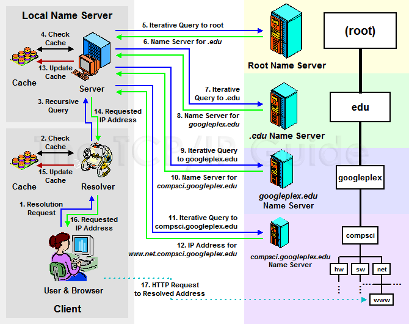

# DNS Sorgusu

.fx: first

Emre Can Yılmaz `<ecylmz@bil.omu.edu.tr>`

[http://ecylmz.com/](http://ecylmz.com)

Temmuz 2012

---

# DNS

---

**Bilgisayarlar ve diğer cihazlar haberleşmek için her birine bir ip adresi
atanır.**

    209.85.129.103
    192.228.29.1
    74.125.77.106
    147.67.119.102
    142.236.154.112
    92.123.68.25
    193.252.122.103

---

**İnsanlar ip adreslerini hatırlayamadıklarından kelimeleri kullanırlar**

    www.google.com
    www.cira.ca
    www.google.it
    www.euroa.eu
    www.servicecanada.gc.ca
    www.cbc.ca
    www.orange.fr

---

Alan adı sistemi (DNS(Domain Name System)) ip adresleri ve onlara karşı
kullanılan isimleri barındırır. Yani büyük bir veritabanıdır diyebiliriz.

    209.85.129.103    -   www.google.com
    192.228.29.1      -   www.cira.ca
    74.125.77.106     -   www.google.it
    147.67.119.102    -   www.euroa.eu
    142.236.154.112   -   www.servicecanada.gc.ca
    92.123.68.25      -   www.cbc.ca
    193.252.122.103   -   www.orange.fr

---

# DNS Sorgusu Nasıl Çalışır?

DNS sorgusunun nasıl çalıştığını anlamak için basit bir örnek kullanalım.

Tarayıcıya **www.example.com** yazdık ve enter'a bastık.

Sırasıyla şunlar olmaktadır:

---

# DNS Sorgusu

- Web tarayıcısı adres satırına isim girdiğinizi anlar ve ip'sini bulmak için
   yerel çözümleyici çağırır.

- Çözümleyici önbelleği (cache) kontrol eder, eğer daha önceden bu isim için ip
   eşleştirilmesi yapılmışsa onu kullanır ve web tarayıcısına ip'i verir.
   Önbellekte eğer ki ip - isim eşleştirmesi yoksa; "host table file" denen
   dosyaya bakar( Bu Ubuntu'da /etc/hosts dosyasıdır ). Bu dosyada ip'lere
   isimler statik olarak tanımlanır. Bu dosyada ip'i bulabilirse web tarayıcıya
   ip'i verir.

Örnek bir `/etc/hosts` dosyası:

    127.0.0.1       localhost
    127.0.1.1       foo

    123.1.2.3       www.example.com

---

# DNS Sorgusu

- Çözümleyici özyineli olarak bu sorguyu oluşturur ve cihazda tanımlanan,
   internet üzerindeki bir DNS sunucusuna sorguyu gönderir.Ubuntu'da DNS
   sunucularının adreslerini /etc/resolv.conf'da tanımlıyoruz.

   Örnek bir **resolv.conf** dosyası:

       nameserver 8.8.8.8

Diyelim ki DNS sunucusu olarak 8.8.8.8'i kullanıyoruz.

- "8.8.8.8" www.example.com için tekrarlı sorgular üretir ve **kök isim
   sunucusuna** bu sorguları gönderir. (Tabi ki onun da önbelleğinde ip adresi
   yoksa)

- Kök isim sunucusu ismi çözmez. O sadece ".com" domain'leriyle ilgilenen DNS
   sunucunun isminin ip'sini verir.

---

# DNS Sorgusu

- "8.8.8.8" sorguyu üretir ve ".com" domainlerinden sorumlu DNS sunucusuna
   sorguyu gönderir.

- .com'la ilgilenen sunucu "example.com"'un ip'sini döner.

- "8.8.8.8" example.com'la ilgilenen sunucuya www.example.com için sorgu
   gönderir.

- example.com kendi kaynaklarına bakar. www subdomain'i için
   yetkilendirildiğinden yani www ile o ilgilendiğinden www.example.com için
   ip'yi "8.8.8.8"'e verir.

- "8.8.8.8" bu cevabı önbelleğine kaydeder ve tanımlanan süre içerisinde bunu
    saklar.

---

- Yerel isim sunucusunda artık www.example.com'un ip adresi vardır ve
    bilgisayarınızdaki çözümleyiciye verir.

- Yerel çözümleyici bu bilgiyi önbelleğine kaydeder.

- Çözümleyici ip'i web tarayıcısına verir.

- Ve web tarayıcı HTTP isteklerini www.example.com'un ip'sine gönderir ve
    gelen cevabı render ederek sayfayı ekrana bastırır.

---

**www.net.compsci.googleplex.edu** için DNS çözümlemesini gösteren resim:

---

# Kaynak

[http://www.tcpipguide.com/free/t_DNSNameResolutionProcess-2.htm](http://www.tcpipguide.com/free/t_DNSNameResolutionProcess-2.htm)
